<!-- =============================== -->
<!-- 🌌 Animated Matrix Background -->
<!-- =============================== -->

<!-- =============================== -->
<!-- ✨ Divider -->
<!-- =============================== -->
<h3 align="center">
  
</h3>

<!-- =============================== -->
<!-- 🖊️ Typing Animation Effect -->
<!-- =============================== -->

  

<!-- =============================== -->
<!-- 👁️ GitHub Profile View Counter -->
<!-- =============================== -->

  

<!-- =============================== -->
<!-- 🖼️ Header Image Banner -->
<!-- =============================== -->

  

<!-- ✨ Divider -->
<h3 align="center">
  
</h3>

<!-- =============================== -->
<!-- 🙋‍♂️ About Section -->
<!-- =============================== -->

    
<h2>  Briefly about me </h2>

    
 I am a Backend Developer   from Egypt.

    
    <h3>   A little more detail: </h3>
    <ul>
        <li><a>&nbsp; I am a Computer Science & AI graduate, passionate about backend development.</a></li> 
        <li><a>&nbsp; Working on **.NET Backend projects** and exploring cloud technologies.</a></li> 
      <li><a>&nbsp; I am always learning something new in programming and backend development.</a></li> 
      <li><a>&nbsp; Top-tier gamer with high skill in Valorant, Elden Ring, and Sekiro.</a></li> 
    </ul>

<!-- ✨ Divider -->
<h3 align="center">
  
</h3>

<!-- =============================== -->
<!-- 🖥️ Interactive Terminal View -->
<!-- =============================== -->
 

  
  

    
See more

      
    

  
GitHub Stats

 

  

<!-- ✨ Divider -->
<h3 align="center">
  
</h3>

<!-- =============================== -->
<!-- 🛠️ Tech Stack Icons -->
<!-- =============================== -->

## 🛠️ Tech Stack

  <!-- Main Backend & Tools -->
  
  
  <!-- Databases & DevOps -->
  
  

---

<!-- =============================== -->
<!-- 🎭 Random Dev Joke Generator -->
<!-- =============================== -->

 
  <i>Random Dev Joke for You! 🎭</i>  
  

<!-- ✨ Divider -->
<h3 align="center">
  
</h3>

<!-- =============================== -->
<!-- 📊 GitHub Stats Section -->
<!-- =============================== -->

## 📊 GitHub Stats

  
  
  

---

<!-- =============================== -->
<!-- 🗂️ Summary Cards & Productive Hours -->
<!-- =============================== -->

## 💳 Profile Summary & Productive Time

  
  

<!-- ✨ Divider -->
<h3 align="center">
  
</h3>

<!-- =============================== -->
<!-- 📌 Pinned GitHub Repositories -->
<!-- =============================== -->

## 🚀 Pinned Projects

  
  

---

<!-- =============================== -->
<!-- 🧮 LeetCode Profile Card -->
<!-- =============================== -->

## 🧮 LeetCode Profile

  

---

<!-- =============================== -->
<!-- 🧠 Inspirational Quote Widget -->
<!-- =============================== -->

## 🧠 Quote to Live By

  

<!-- ✨ Divider -->
<h3 align="center">
  
</h3>

<!-- =============================== -->
<!-- 📅 Contribution Activity Graph -->
<!-- =============================== -->

## 📅 Contribution Graph

  

---

<!-- =============================== -->
<!-- 🏆 GitHub Trophy Showcase -->
<!-- =============================== -->

## 🏆 GitHub Trophies

  

<!-- ✨ Divider -->
<h3 align="center">
  
</h3>

<!-- =============================== -->
<!-- 🔋 Work Mode Animation Footer -->
<!-- =============================== -->

## 🌀 Working Mode Activated

  

<!-- ✨ Divider -->
<h3 align="center">
  
</h3>

<!-- =============================== -->
<!-- 🔗 Snake Contribution -->
<!-- =============================== -->

### 🐍 Pacman Contribution Graph

<picture>
  <source media="(prefers-color-scheme: dark)" srcset="https://raw.githubusercontent.com/grajrb/grajrb/output/pacman-contribution-graph-dark.svg">
  <source media="(prefers-color-scheme: light)" srcset="https://raw.githubusercontent.com/grajrb/grajrb/output/pacman-contribution-graph.svg">
  
</picture> 

<!-- Alternative snake animation if the above doesn't work -->
<!--  -->

<!-- ✨ Divider -->
<h3 align="center">
  
</h3>

<!-- =============================== -->
<!-- 🔗 Social & Portfolio Links -->
<!-- =============================== -->

## 🔗 Let's Connect

  
  
  
  
  

---

  <b>💻 Made By ❤️ Khaled Abd Elhanan © All Rights Reserved 2025</b>

